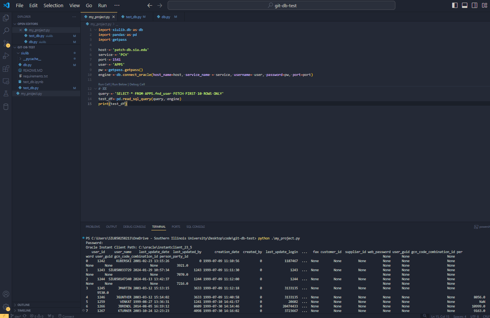

# SIU Python Library
Useful common functions for Salukis.  In the future, this will be in the form of a [pip package](https://pip.pypa.io/en/stable/getting-started/), but for now we'll clone this repo into our project directory.

## Oracle DB Link
We are using the Oracle Instant Client ("thick mode") for all connections to the AIS/SIS databases.  The connection to the database is handled via the Python database toolkit, [SQLAlchemy](https://www.sqlalchemy.org/).  The examples in this code also the [Pandas](https://pandas.pydata.org/) data manipulation library to transform SQL queries to Python datatables.  This helper library (db.py) facilitates the setup of DB connections with these tools.

### Instructions

1. [Set up VSCode and the Python Extension and Jupyter Extensions](https://loop.cloud.microsoft/p/eyJ3Ijp7InUiOiJodHRwczovL3NhbHVraS5zaGFyZXBvaW50LmNvbS8%2FbmF2PWN6MGxNa1ltWkQxaUlWWjFRbFp1VFcxa2VUQjVSbVk0UkhjMVRIRnBhbUpJYjBGbGJHaHJWM1JPYTJkbmFsOUpUbGhUUzNoaE9VZHJkR2hzWHpkU1lYcDBSRXh2Vm00NE55MG1aajB3TVZkWlIwdEZWalZHVWs1V1MxSklWVlkwVGtkTFEweFpVRGRDTlU5R1FrVlhKbU05Sm1ac2RXbGtQVEUlM0QiLCJyIjpmYWxzZX0sInAiOnsidSI6Imh0dHBzOi8vc2FsdWtpLnNoYXJlcG9pbnQuY29tLzpmbDovZy9jb250ZW50c3RvcmFnZS9DU1BfMzlhY2ZkYzItYzY4OS00ODFjLTg2ODktNmNiZmM3ZDViZGFmL0VkNElFQWZIYW5oQ3BRcHFaUkRhU3djQk56aEJHR250NlpEWWFYSXJrY1dkb3c%2FbmF2PWN6MGxNa1pqYjI1MFpXNTBjM1J2Y21GblpTVXlSa05UVUY4ek9XRmpabVJqTWkxak5qZzVMVFE0TVdNdE9EWTRPUzAyWTJKbVl6ZGtOV0prWVdZbVpEMWlJWGQyTW5OUFdXNUhTRVZwUjJsWGVWOTRPVmM1Y2pSSFkwMVdWRWM0YzJoTGRFNXBiVXRaYlhFNGNXMWFTMmx5V1RWemJrWlNTVlZrVDBsaFgzRjFVR3dtWmowd01VODJNMUpDU0ZjMlFrRkpRVkJTTTB0UVFrSkxTME5VUzAxVlNVNVZVMWxJSm1NOUpUSkdKbVpzZFdsa1BURSUzRCIsInIiOnRydWV9LCJpIjp7ImkiOiI1ODEwMmNhYy0wYzcyLTRhZjQtYTQ4YS1mOTk0MGIyODI3OGYifX0%3D)
2. Set up a [virtual environment](https://saluki.sharepoint.com/:fl:/g/contentstorage/CSP_9c55e056-9dc9-4ccb-857f-c0f0e4baa28d/EXuu8Laq8N9JsBvBKL0xw1oBA1P34DrcLGHWLwb5fBZX-g?e=Szl99g&nav=cz0lMkZjb250ZW50c3RvcmFnZSUyRkNTUF85YzU1ZTA1Ni05ZGM5LTRjY2ItODU3Zi1jMGYwZTRiYWEyOGQmZD1iIVZ1QlZuTW1keTB5RmY4RHc1THFpamJIb0FlbGhrV3ROa2dnal9JTlhTS3hhOUdrdGhsXzdSYXp0RExvVm44Ny0mZj0wMVdZR0tFVjMzVjNZTE5LWFEzNUUzQUc2QkZDNlREUTIyJmM9JTJGJmZsdWlkPTEmYT1Mb29wQXBwJnA9JTQwZmx1aWR4JTJGbG9vcC1wYWdlLWNvbnRhaW5lciZ4PSU3QiUyMnclMjIlM0ElMjJUMFJUVUh4ellXeDFhMmt1YzJoaGNtVndiMmx1ZEM1amIyMThZaUZXZFVKV2JrMXRaSGt3ZVVabU9FUjNOVXh4YVdwaVNHOUJaV3hvYTFkMFRtdG5aMnBmU1U1WVUwdDRZVGxIYTNSb2JGODNVbUY2ZEVSTWIxWnVPRGN0ZkRBeFYxbEhTMFZXTlVaU1RsWkxVa2hWVmpST1IwdERURmxRTjBJMVQwWkNSVmMlM0QlMjIlMkMlMjJpJTIyJTNBJTIyNTgxMDJjYWMtMGM3Mi00YWY0LWE0OGEtZjk5NDBiMjgyN2I1JTIyJTdE)
3. Navigate to your project path and clone this repo using this command: 
>__git clone https://github.com/richard-mabley-siu/siulib__
4. Run the following command to install dependencies:
>__pip install -r .\siulib\requirements.txt__ 
5. Edit __test_db.py__ for your connection details, credentials, and test query.
6. Run the test db connection file:
>__python test_db.py__
8. Ensure that the test query returns data.
9. If you are getting errors about the Oracle Client, see instructions in the db.py file for installing the client and setting up environmental variables.  db.py will automatically detect whether you are in a Windows or Linux environment and throw errors appropriately.
10. In your project file, add a line at the top:
>__import siulib.db as db__
11. You'll now be able to create a database connection in your project using 
>__engine = db.connect_oracle(host_name=host, service_name = service, username= user, password=pw, port=port)__

12. Read more about the [SQLAlchemy](https://docs.sqlalchemy.org/en/20/) and [Pandas](https://pandas.pydata.org/docs/user_guide/10min.html) libraries commonly used for data connections and manipulation in Python. 

_Note: If you are working on the Linux server, you will need to use python3/pip3 rather than python/pip for all commands._

## Screenshot of Test Project Referencing siulib.db
